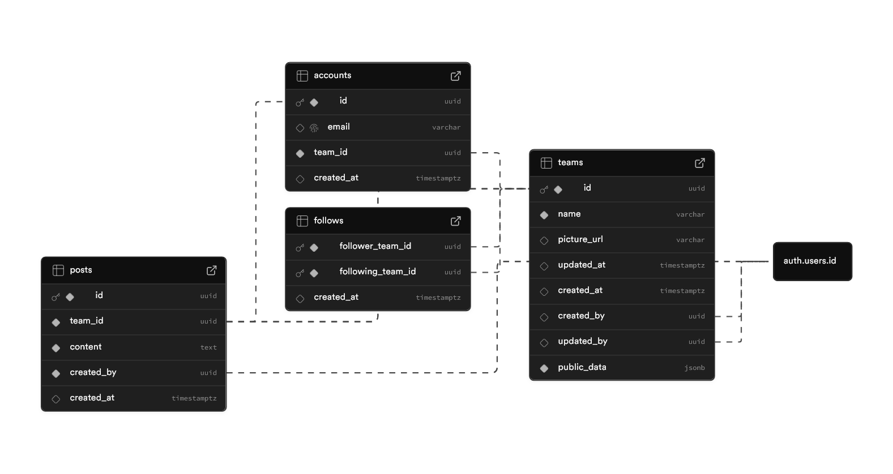

<a name="readme-top"></a>

<!-- PROJECT LOGO -->
<br />
<div align="center">
  <a href="https://github.com/kaylaa0/venn">
    
  </a>
  <p align="center">
    <h3 align="center">Venn – Team-Based Social Platform</h3>
    <a href="https://venn.kayla.works/"><strong>View Live Website »</strong></a>
  </p>
</div>

<!-- TABLE OF CONTENTS -->
<details>
  <summary>Table of Contents</summary>
  <ol>
    <li>
      <a href="#about">About</a>
      <ul>
        <li><a href="#built-with">Built With</a></li>
      </ul>
    </li>
    <li>
      <a href="#getting-started">Getting Started</a>
      <ul>
        <li><a href="#prerequisites">Prerequisites</a></li>
        <li><a href="#installation">Installation</a></li>
      </ul>
    </li>
    <li><a href="#supabase-schema">Supabase Schema</a></li>
    <li><a href="#key-assumptions--trade-offs">Key Assumptions & Trade-offs</a></li>
    <li><a href="#what-i-would-improve-with-more-time">What I Would Improve With More Time</a></li>
    <li><a href="#project-structure">Project Structure</a></li>
    <li><a href="#environment-variables">Environment Variables</a></li>
    <li><a href="#contact">Contact</a></li>
  </ol>
</details>

<!-- ABOUT THE PROJECT -->

## About

Venn is a team-based social platform built on top of a Next.js 15 + Supabase SaaS starter kit (Makerkit Lite). It features team management, social feeds, user authentication, and protected routes — all within a Turborepo monorepo architecture.

### Built With

* [![Next.js][Next.js]][Next.js-url]
* [![Supabase][Supabase]][Supabase-url]
* [![TypeScript][TypeScript]][TypeScript-url]
* [![TailwindCSS][TailwindCSS]][TailwindCSS-url]
* [![Node.js][Node.js]][Node.js-url]
* [![Pnpm][Pnpm]][Pnpm-url]

<p align="right">(<a href="#readme-top">back to top</a>)</p>

<!-- GETTING STARTED -->

## Getting Started

### Prerequisites

- **Node.js** 18.x or later (preferably the latest LTS version)
- **Docker** (required for the Supabase CLI)
- **pnpm**

Make sure you have a Docker daemon running on your machine before starting Supabase.

### Installation

1. **Clone the repository**
   ```sh
   git clone https://github.com/kaylaa0/venn.git
   cd venn
   ```

2. **Install dependencies**
   ```sh
   pnpm install
   ```

3. **Start Supabase**
   ```sh
   pnpm run supabase:web:start
   ```
   Once running, access the Supabase Dashboard at [http://localhost:54323](http://localhost:54323).

4. **Start the Next.js application**
   ```sh
   pnpm run dev
   ```
   The application will be available at [http://localhost:3000](http://localhost:3000).

5. **Code Health (optional)**
   ```sh
   # Format code
   pnpm run format:fix

   # Lint code
   pnpm run lint

   # Type check
   pnpm run typecheck
   ```

#### Useful Supabase Commands

| Command | Description |
| --- | --- |
| `pnpm run supabase:web:start` | Start local Supabase |
| `pnpm run supabase:web:stop` | Stop local Supabase |
| `pnpm run supabase:web:reset` | Reset database & apply migrations + seed |
| `pnpm --filter web supabase migration new <name>` | Create a new migration |
| `pnpm --filter web supabase db push` | Push migrations to remote project |
| `pnpm --filter web supabase link` | Link to remote Supabase project |

<p align="right">(<a href="#readme-top">back to top</a>)</p>

<!-- SUPABASE SCHEMA -->

## Supabase Schema

### Tables



### Row Level Security (RLS) Summary

All tables have RLS **enabled**. Authorization is enforced at the database layer rather than relying on application middleware alone. Below is a summary of the policies per table:

| Table | Operation | Policy | Rule |
| --- | --- | --- | --- |
| **teams** | `SELECT` | Public read | Everyone (including `anon`) can read all teams |
| **teams** | `UPDATE` | Owner only | Only authenticated users whose `accounts.team_id` matches the team `id` |
| **teams** | `INSERT` | Service role | Created automatically via the `on_auth_user_created` trigger (service role) |
| **accounts** | `SELECT` | Self only | Users can only read their own account (`auth.uid() = id`) |
| **accounts** | `UPDATE` | Self only | Users can only update their own account (`auth.uid() = id`) |
| **accounts** | `INSERT` | Service role | Created automatically via the `on_auth_user_created` trigger (service role) |
| **posts** | `SELECT` | Public read | Global feed is public — everyone can read all posts |
| **posts** | `INSERT` | Team members | User must belong to a team (`accounts.team_id` check via `auth.uid()`) |
| **follows** | `SELECT` | Public read | Follow relationships are publicly visible |
| **follows** | `INSERT` | Team members | Only members of the follower team can create follow relationships |
| **follows** | `DELETE` | Team members | Only members of the follower team can unfollow |
| **storage (team_image)** | `SELECT` | Public read | Anyone can view team images |
| **storage (team_image)** | `INSERT` | Team members | Authenticated users can upload to their own team's folder only |
| **storage (team_image)** | `UPDATE` | Team members | Authenticated users can update files in their own team's folder only |
| **storage (team_image)** | `DELETE` | Team members | Authenticated users can delete files from their own team's folder only |

**Additional safeguards:**
- **Field protection triggers** on `teams` and `accounts` prevent authenticated users from modifying immutable fields (e.g., `id`, `email`).
- **Auto-assign triggers** (`tr_auto_assign_post_team`, `tr_auto_assign_follower_team`) run as `security definer` to automatically populate `team_id` and `created_by` from the authenticated user's session, preventing spoofing.
- **Self-follow constraint** (`check_not_self_follow`) prevents a team from following itself at the database level.
- **Team membership constraint** (`fk_poster_must_be_on_team`) ensures a post's `created_by` user actually belongs to the post's `team_id`.
- The `anon` role has **all privileges revoked** on `public`, `storage`, and the database — unauthenticated users cannot modify any data.

<p align="right">(<a href="#readme-top">back to top</a>)</p>

<!-- KEY ASSUMPTIONS & TRADE-OFFS -->

## Key Assumptions & Trade-offs

| Area | Decision | Rationale |
| --- | --- | --- |
| **Auth** | Supabase Auth (email/password) | Built-in, zero-config auth with session management and RLS integration |
| **Database** | Supabase (Postgres) | Tight integration with auth, instant APIs, and real-time capabilities |
| **Monorepo** | Turborepo | Faster builds via caching, clear package boundaries, shared code between apps |
| **Styling** | TailwindCSS v4 + Shadcn UI | Rapid UI development with consistent, accessible components |
| **i18n** | i18next | Future-proofing for multi-language support even if only one language is used initially |
| **RLS over middleware** | Row Level Security as primary authorization | Security enforced at the database layer rather than relying solely on application middleware |
| **Team creation** | Any authenticated user can create a team | Simplicity-first approach; no approval workflow for team creation |
| **Team joining** | Any authenticated user can join a team | Simplicity-first approach; no approval or invitation workflow for team joining |
| **Team Moderation** | Any member of the team can change team information and moderate | Again for the MVP project we focus on simplicity therefore there are no roles and restrictions |
| **Deleting Team/Posts/Users** | Deleting capabilities are unavailable | Deleting is not supported in the MVP to avoid accidental data loss |
| **Post Ownership** | Recording created_by as well as team_id | This ensures that posts are tied to both the user who created them and the team they belong to, enabling proper access control and accountability. |


<p align="right">(<a href="#readme-top">back to top</a>)</p>

<!-- WHAT I WOULD IMPROVE WITH MORE TIME -->

## What I Would Improve With More Time

### 1. 🔐 Role-Based Team Gatekeeping

The current implementation allows open team access, which can lead to trolling, spam, and abuse. With more time, I would implement a **role-based access control system** with an invitation mechanism:

```
Enum Role {
  MODERATOR   // Can change profile pictures, settings, manage team
  RECRUITER   // Can send invitations, accept join requests
  MEMBER      // Can post, follow/unfollow, like, comment
  PENDING     // View-only access — can see global & followed feeds, nothing else
}
```

**How it would work:**
- A `user_role` column would be added to the team membership table.
- When a user **creates** a new team, they become the `MODERATOR`.
- Users can join existing teams via an **invitation code** — entering a valid code grants `MEMBER` (or higher) role.
- Users joining **without** an invitation code are assigned the `PENDING` role with minimal permissions (view-only).
- `RECRUITER` role holders can generate invitation codes and accept/reject pending join requests.

This prevents abuse while keeping onboarding flexible.

### 2. 📝 Rich Text & Media Embedding for Posts
- Add ability to format text of posts and embed media (images, videos).
- Implement a commenting system for posts.
- Add a "like" feature for posts and comments.

### 3. 🌐 More Languages for Internationalization (i18n)
- Add support for additional languages beyond English.
- Implement language selection in user settings.

### 4. 💬 Team Internal Chat & Collaboration
- Implement a real-time chat feature for team members using Supabase's real-time capabilities.
- Allow users to create channels, send messages, and share files within their team.

### 5. 🔍 Search Functionality
- Implement search for teams, posts, and users.

### 6. 🏷️ Hashtags & Mentions
- Allow users to tag posts with hashtags and mention other users.
- Implement notifications for mentions.

### 7. ✅ Comprehensive Test Suite
- Expand Playwright E2E tests to cover all critical user flows.
- Add unit tests for business logic and API routes.

### 8. 📊 Analytics & Monitoring
- Integrate PostHog or Umami for usage analytics.
- Add Sentry for error tracking and performance monitoring.

### 9. 🎨 UI/UX Enhancements
- Redesign the UI to give Venn a more unique and polished look, moving away from the default Shadcn styles.
- Add animations and micro-interactions for a more engaging user experience.

<p align="right">(<a href="#readme-top">back to top</a>)</p>

<!-- PROJECT STRUCTURE -->

## Project Structure

```
apps/
├── web/                  # Next.js application
│   ├── app/             # App Router pages
│   │   ├── (marketing)/ # Public marketing pages
│   │   ├── auth/        # Authentication pages
│   │   └── home/        # Protected app pages
│   ├── supabase/        # Database & migrations
│   └── config/          # App configuration
│
packages/
├── ui/                  # Shared UI components
└── features/           # Core feature packages
    ├── auth/           # Authentication logic
    └── ...
```

<p align="right">(<a href="#readme-top">back to top</a>)</p>

<!-- ENVIRONMENT VARIABLES -->

## Environment Variables

Configure the application via `.env.local`:

| Variable | Description | Default |
| --- | --- | --- |
| `NEXT_PUBLIC_SITE_URL` | Application URL | `http://localhost:3000` |
| `NEXT_PUBLIC_PRODUCT_NAME` | Product name | `Venn` |
| `NEXT_PUBLIC_SITE_TITLE` | Site title | `Venn` |
| `NEXT_PUBLIC_SITE_DESCRIPTION` | Site description | (see `.env`) |
| `NEXT_PUBLIC_DEFAULT_THEME_MODE` | Default theme | `light` |
| `NEXT_PUBLIC_THEME_COLOR` | Theme color (light) | `#ffffff` |
| `NEXT_PUBLIC_THEME_COLOR_DARK` | Theme color (dark) | `#0a0a0a` |
| `NEXT_PUBLIC_SUPABASE_URL` | Supabase URL | `http://127.0.0.1:54321` |
| `NEXT_PUBLIC_SUPABASE_ANON_KEY` | Supabase anon key | — |
| `SUPABASE_SERVICE_ROLE_KEY` | Supabase service role key | — |

<p align="right">(<a href="#readme-top">back to top</a>)</p>

<!-- CONTACT -->

## Contact

Kayla Akyüz — kaylakyuz@gmail.com

Project Link: [GitHub](https://github.com/kaylaa0/venn)

[![LinkedIn][linkedin-shield]][linkedin-url]

<p align="right">(<a href="#readme-top">back to top</a>)</p>

<!-- MARKDOWN LINKS & IMAGES -->

[linkedin-shield]: https://img.shields.io/badge/-LinkedIn-black.svg?style=for-the-badge&logo=linkedin&colorB=0077B5&colorA=0077B5
[linkedin-url]: https://www.linkedin.com/in/-kayla-/
[Next.js]: https://img.shields.io/badge/Next.js-000000?logo=next.js&logoColor=fff&style=for-the-badge
[Next.js-url]: https://nextjs.org/
[TypeScript]: https://img.shields.io/badge/TypeScript-3178C6?logo=typescript&logoColor=fff&style=for-the-badge
[TypeScript-url]: https://www.typescriptlang.org/
[Supabase]: https://img.shields.io/badge/Supabase-3FCF8E?logo=supabase&logoColor=fff&style=for-the-badge
[Supabase-url]: https://supabase.com/
[TailwindCSS]: https://img.shields.io/badge/Tailwind_CSS-06B6D4?logo=tailwindcss&logoColor=fff&style=for-the-badge
[TailwindCSS-url]: https://tailwindcss.com/
[Node.js]: https://img.shields.io/badge/Node.js-339933?logo=node.js&logoColor=fff&style=for-the-badge
[Node.js-url]: https://nodejs.org/
[Pnpm]: https://img.shields.io/badge/pnpm-F69220?logo=pnpm&logoColor=fff&style=for-the-badge
[Pnpm-url]: https://pnpm.io/